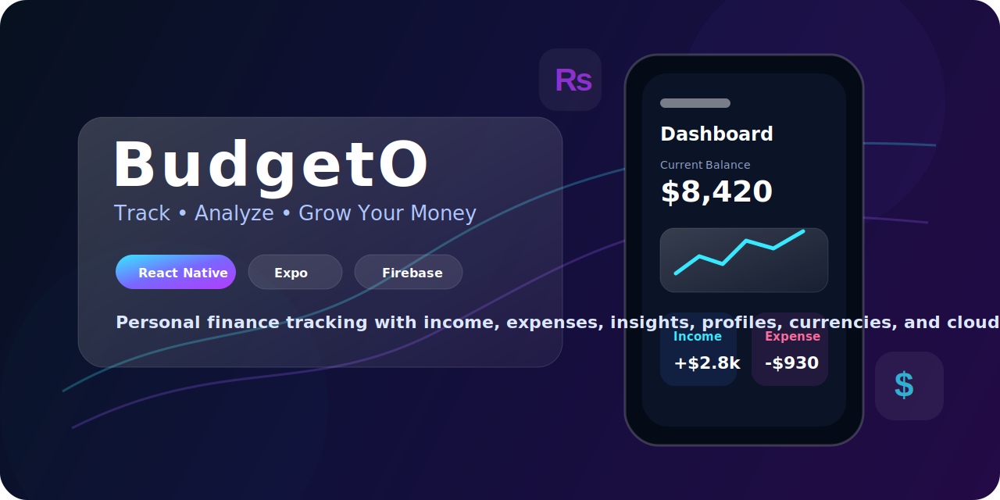
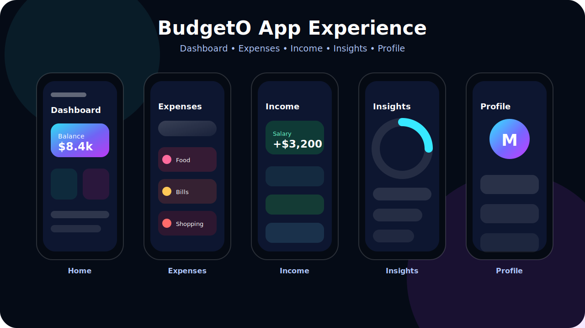
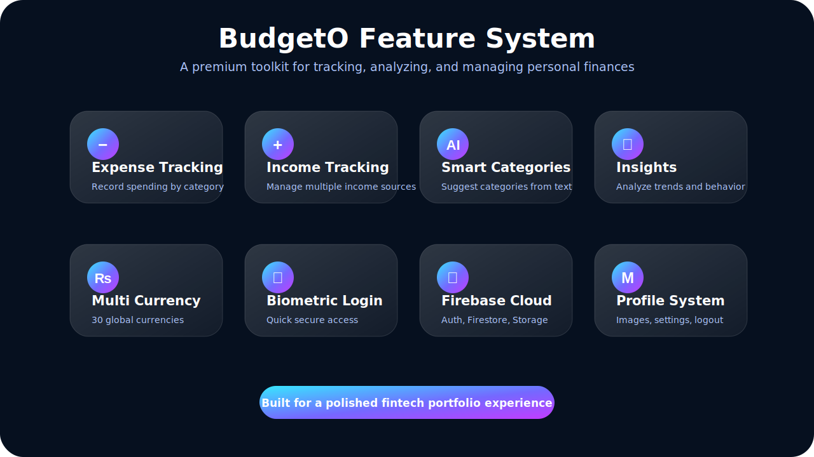
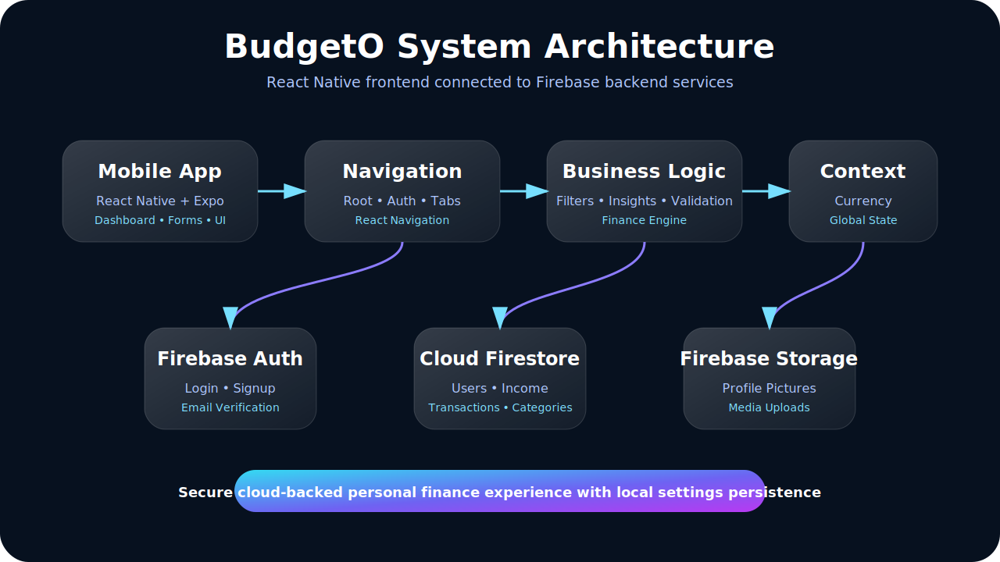

<div align="center">



# 💸 BudgetO

### Premium Personal Finance Tracking App

A modern mobile finance manager for tracking expenses, income, categories, currencies, insights, and user profiles with a polished React Native experience.

Built with **React Native**, **Expo**, **Firebase Authentication**, **Cloud Firestore**, **Firebase Storage**, **AsyncStorage**, and **React Navigation**.

</div>

---

## Table of Contents

- [Overview](#overview)
- [App Showcase](#app-showcase)
- [Problem Statement](#problem-statement)
- [Core Features](#core-features)
- [Tech Stack](#tech-stack)
- [System Architecture](#system-architecture)
- [Application Flow](#application-flow)
- [Data Model](#data-model)
- [Authentication Flow](#authentication-flow)
- [Expense Management Flow](#expense-management-flow)
- [Income Management Flow](#income-management-flow)
- [Currency System](#currency-system)
- [AI-Style Financial Intelligence](#ai-style-financial-intelligence)
- [Profile & Settings](#profile--settings)
- [Folder Structure](#folder-structure)
- [Important Screens](#important-screens)
- [How Data Is Handled](#how-data-is-handled)
- [Performance & UX Enhancements](#performance--ux-enhancements)
- [Security Notes](#security-notes)
- [Installation](#installation)
- [Available Scripts](#available-scripts)
- [Environment Setup](#environment-setup)
- [Future Improvements](#future-improvements)
- [Author](#author)

---

## Overview

**BudgetO** is a mobile-first personal finance tracking application that helps users manage expenses, income, categories, currencies, and financial activity from a clean dashboard.

The app focuses on three major goals:

1. **Track money movement** — record expenses and income with categories, dates, descriptions, and currency.
2. **Understand financial behavior** — show recent activity, spending trends, category breakdowns, and AI-style insights.
3. **Personalize the experience** — support user profiles, profile images, currency settings, authentication, and biometric quick login.

BudgetO is built as a real-world React Native project with Firebase backend services and a premium dark-themed interface.

---

## App Showcase



BudgetO is designed around a polished fintech experience with separate flows for dashboard overview, expense tracking, income tracking, financial insights, and profile/settings management.

---

## Problem Statement

Most students, freelancers, and young professionals lose control of their money because they do not track small expenses, income sources, or category-wise spending patterns.

BudgetO solves this by giving users:

- A fast way to record expenses.
- A dedicated income tracking system.
- Category-based organization.
- Smart category suggestions.
- Recent financial activity.
- Currency personalization.
- Firebase-backed authentication and data storage.

---

## Core Features



### Authentication

- Email/password signup.
- Firebase Authentication login.
- Email verification after signup.
- Forgot password flow.
- Persistent auth state.
- Biometric quick login support using Expo Local Authentication.

### Dashboard

- Personalized greeting.
- Current balance card.
- Recent transactions.
- Financial insight cards.
- Quick actions for adding expenses and income.
- Animated UI entrance effects.

### Expense Tracking

- Add expense transactions.
- Edit transactions.
- Delete transactions.
- Search transactions.
- Filter transactions by time range.
- Category-based transaction display.
- Custom category colors.
- Quick-add from recent transactions.
- AI-style category suggestions from descriptions.

### Income Tracking

- Add income entries.
- Edit income records.
- Delete income records.
- Search income.
- Filter income by time range.
- Income category management.
- Income source insights.
- Diversification analysis.

### Category Management

- Expense categories.
- Income categories.
- Color-coded categories.
- Category icons.
- Auto-create category if it does not exist.
- Batch delete categories and related records.

### Currency System

- Global currency context.
- 30 supported currencies.
- Currency persisted locally with AsyncStorage.
- Currency synced with Firestore user settings.
- Amount formatter with currency symbols.

### Profile Management

- View user profile.
- Edit display name.
- Upload profile picture using Expo Image Picker.
- Store profile images in Firebase Storage.
- Select preferred currency.
- Logout and clear local storage.

---

## Tech Stack

### Core

- React Native
- Expo
- JavaScript
- React

### Navigation

- React Navigation Stack
- React Navigation Bottom Tabs
- Material Bottom Tabs

### Backend

- Firebase Authentication
- Cloud Firestore
- Firebase Storage

### Local Storage

- AsyncStorage

### UI & Interaction

- Expo Linear Gradient
- Expo Haptics
- React Native Reanimated
- React Native Gesture Handler
- React Native Safe Area Context
- React Native Vector Icons
- Expo Status Bar

### Native Capabilities

- Expo Image Picker
- Expo Local Authentication
- Expo Notifications
- Expo Print
- Expo Sharing

### Data Visualization

- React Native Chart Kit
- Victory Native
- React Native SVG

### Internationalization

- i18next
- React i18next
- Expo Localization

---

## System Architecture



```text
Mobile App
  ↓
Navigation Layer
  ↓
Presentation Layer
  ↓
Business Logic Layer
  ↓
Firebase Auth + Firestore + Storage
  ↓
AsyncStorage Local Persistence
```

BudgetO follows a mobile-first layered architecture. The UI is separated through navigation stacks, screen modules, reusable components, global styles, currency context, and Firebase-backed data operations.

---

## Application Flow

### Startup Flow

```text
App.js
  │
  ▼
SafeAreaProvider
  │
  ▼
GestureHandlerRootView
  │
  ▼
CurrencyProvider
  │
  ▼
NavigationContainer
  │
  ▼
RootNavigator
```

### Auth Routing

```text
RootNavigator
  │
  ├── User not authenticated
  │       └── AuthStack
  │             ├── SplashScreen
  │             ├── Login
  │             ├── SignUp
  │             ├── EmailVerification
  │             └── ForgotPassword
  │
  └── User authenticated
          └── BottomTab
                ├── Home
                ├── TransactionStack
                ├── IncomeStack
                └── ProfileStack
```

---

## Data Model

BudgetO uses Cloud Firestore as the main database.

### users

```text
users/{userId}
├── username
├── email
├── profileImageUrl
├── createdAt
└── settings
    ├── currency
    ├── notifications
    └── biometric
```

### transactions

```text
transactions/{transactionId}
├── userId
├── amount
├── description
├── categoryId
├── category
├── color
├── date
├── currency
├── createdAt
├── updatedAt
├── type: "expense"
├── status
└── metadata
    ├── deviceType
    └── appVersion
```

### categories

```text
categories/{categoryId}
├── userId
├── name
├── color
├── icon
├── type: "expense"
├── createdAt
└── updatedAt
```

### income

```text
income/{incomeId}
├── userId
├── amount
├── description
├── categoryId
├── category
├── currency
├── date
├── createdAt
├── updatedAt
└── type: "income"
```

### incomeCategories

```text
incomeCategories/{categoryId}
├── userId
├── name
├── color
├── icon
├── createdAt
└── updatedAt
```

### Firebase Storage

```text
profile_pictures/{userId}.jpg
```

---

## Authentication Flow

```text
User opens app
      │
      ▼
Firebase checks auth state
      │
      ├── No user
      │     └── AuthStack
      │
      └── Existing user
            └── Main app tabs
```

### Signup Flow

```text
User enters name, email, password
      │
      ▼
Firebase creates account
      │
      ▼
User document is created in Firestore
      │
      ▼
Email verification is sent
      │
      ▼
User is redirected to verification screen
```

### Login Flow

```text
User enters email and password
      │
      ▼
Firebase Authentication validates credentials
      │
      ▼
User settings are loaded from Firestore
      │
      ▼
Main app opens
```

### Biometric Login Flow

```text
Device supports biometrics
      │
      ▼
Saved credentials are available
      │
      ▼
User authenticates with biometrics
      │
      ▼
App signs in using saved credentials
```

---

## Expense Management Flow

```text
User opens Transactions
      │
      ▼
App fetches categories
      │
      ▼
App fetches transactions for current user
      │
      ▼
Transactions are joined with category metadata
      │
      ▼
User can search, filter, view, edit, or delete
```

### Add Expense Flow

```text
User enters amount
      │
      ▼
User enters description
      │
      ▼
AI-style category suggestion runs
      │
      ▼
User selects existing category or creates new one
      │
      ▼
Firestore batch creates/updates category and transaction
      │
      ▼
Expense appears in transactions list
```

---

## Income Management Flow

```text
User opens Income tab
      │
      ▼
App fetches income categories
      │
      ▼
App fetches income records
      │
      ▼
Income records are mapped with category color/name
      │
      ▼
User can search, filter, view, edit, or delete income
```

### Income Insights

BudgetO analyzes income data to calculate:

- Total income.
- Monthly average.
- Growth rate.
- Top income sources.
- Income diversification score.
- Recommendations for financial stability.

---

## Currency System

BudgetO includes a global currency provider with support for currencies such as USD, EUR, GBP, PKR, INR, AED, SAR, JPY, AUD, CAD, CNY, TRY, BDT, and more.

```text
App starts
   │
   ▼
CurrencyProvider loads saved currency from AsyncStorage
   │
   ▼
Firestore user settings are checked
   │
   ▼
Latest currency is applied globally
   │
   ▼
formatAmount() displays values with currency symbols
```

---

## AI-Style Financial Intelligence


BudgetO includes intelligent helper logic for financial interpretation.

### Expense Intelligence

- Category suggestion from description keywords.
- Spending grouped by category.
- Top spending categories.
- Monthly spending average.
- Growth rate calculation.
- Budget recommendations.
- Recurring transaction detection.
- Highest spending day analysis.

### Income Intelligence

- Income grouped by category/source.
- Top income sources.
- Monthly average income.
- Growth rate calculation.
- Diversification score.
- Recommendations for income stability.

> Note: The current implementation uses local rule-based intelligence and analysis logic. The dependency list also includes Google Generative AI, which can be used in future versions for deeper AI insights.

---

## Profile & Settings

The profile module supports:

- Fetching user data from Firestore.
- Editing username.
- Uploading profile picture.
- Storing profile images in Firebase Storage.
- Updating preferred currency.
- Searching currencies.
- Persisting settings with AsyncStorage.
- Syncing settings with Firestore.
- Logging out and clearing local storage.

---

## Folder Structure

```text
Finance-tracking-app/
├── assets/
│   ├── fonts/
│   └── readme/
│       ├── hero-banner.svg
│       ├── app-showcase.svg
│       ├── architecture-diagram.svg
│       ├── finance-intelligence.svg
│       └── feature-grid.svg
│
├── src/
│   ├── Components/
│   │   └── TransactionModal
│   │
│   ├── Drawable/
│   │   └── Images/
│   │
│   ├── global/
│   │   ├── styles
│   │   └── CurrencyContext.js
│   │
│   └── Screens/
│       ├── AuthScreens/
│       ├── HomeScreen/
│       ├── TransactionScreens/
│       ├── BudgetScreen/
│       ├── InsightScreens/
│       ├── ProfileScreens/
│       └── Navigations/
│
├── App.js
├── firebaseConfig.js
├── package.json
└── README.md
```

---

## Important Screens

### App.js

Main app entry wrapper. It initializes the safe-area provider, gesture handling, currency provider, navigation container, and global status bar.

### RootNavigator

Controls authentication-based routing by listening to Firebase auth state and switching between AuthStack and BottomTab.

### BottomTab

Main app navigation shell with a custom animated tab bar, haptic feedback, and routes for Home, Transactions, Income, and Profile.

### Home

Financial dashboard screen for greeting, balance display, financial insight cards, recent transactions, and quick actions.

### Transactions

Expense list and management screen for Firestore transaction fetching, category joining, filtering, searching, editing, deleting, and spending insights.

### AddTransaction

Expense creation screen with validation, quick-add, smart category suggestions, new category creation, and Firestore batch writes.

### Income

Income management screen for income records, categories, filters, search, income analytics, and income detail modals.

### Profile

User profile and settings screen for profile data, image upload, username update, currency selection, and logout.

---

## How Data Is Handled

BudgetO uses three layers of data handling:

### 1. Firebase Authentication

Used for account creation, login, logout, and auth state detection.

### 2. Firestore

Used for structured user data:

- users
- transactions
- categories
- income
- incomeCategories

### 3. AsyncStorage

Used for lightweight local persistence:

- selected currency
- user settings
- profile image cache
- biometric login credentials

### Firestore Read Pattern

Common methods:

- `getDoc()` for one document.
- `getDocs()` for collection queries.
- `query()` for filtering.
- `where()` for user-specific records.
- `orderBy()` and `limit()` for recent activity.

### Firestore Write Pattern

Common methods:

- `setDoc()` for user and settings updates.
- `updateDoc()` for modifying settings.
- `deleteDoc()` for removing records.
- `writeBatch()` for category + transaction operations.

---

## Performance & UX Enhancements

BudgetO includes several design and performance practices:

- `useMemo()` for filtered lists and derived values.
- `useCallback()` for Firestore fetch handlers and event handlers.
- `React.memo()` for reusable cards and screens.
- React Native Animated and Reanimated for smooth UI effects.
- Expo Haptics for tactile mobile feedback.
- Keyboard-aware forms.
- Safe area handling.
- Loading, empty, retry, and error states.
- Gradient cards and glassmorphism UI patterns.

---

## Security Notes

This is a portfolio/development-stage app. Before production release, improve the following:

- Move Firebase configuration into environment variables.
- Avoid storing raw login credentials in AsyncStorage for biometric login.
- Use secure storage for sensitive credentials.
- Add strict Firestore Security Rules.
- Validate user ownership on all reads/writes.
- Add input sanitization.
- Add rate limiting or backend validation for financial records.
- Review Firebase Storage rules for profile images.
- Add error monitoring and crash reporting.

---

## Installation

```bash
git clone https://github.com/codewithmoju/Finance-tracking-app.git
cd Finance-tracking-app
npm install
```

---

## Available Scripts

### Start Expo

```bash
npm start
```

### Android

```bash
npm run android
```

### iOS

```bash
npm run ios
```

### Web

```bash
npm run web
```

---

## Environment Setup

For a safer public/production setup, move Firebase keys into environment variables.

Recommended `.env` structure:

```env
EXPO_PUBLIC_FIREBASE_API_KEY=
EXPO_PUBLIC_FIREBASE_AUTH_DOMAIN=
EXPO_PUBLIC_FIREBASE_PROJECT_ID=
EXPO_PUBLIC_FIREBASE_STORAGE_BUCKET=
EXPO_PUBLIC_FIREBASE_MESSAGING_SENDER_ID=
EXPO_PUBLIC_FIREBASE_APP_ID=
EXPO_PUBLIC_FIREBASE_MEASUREMENT_ID=
```

Then load them inside your Firebase config instead of hardcoding values.

---

## Future Improvements

- Secure biometric credential handling with SecureStore.
- Cloud Functions for server-side validation.
- Firestore transaction-based writes.
- Monthly budget limits.
- Recurring transactions.
- Bill reminders.
- Receipt image upload.
- PDF report export.
- CSV export/import.
- Advanced charts and dashboards.
- Real Gemini-powered financial insights.
- Dark/light theme switching.
- Offline-first sync.
- Unit tests and integration tests.
- App store deployment setup.

---

## Engineering Highlights

This repository demonstrates:

- Firebase Authentication in React Native.
- Firestore data modeling.
- Expense and income CRUD flows.
- User-specific category management.
- Currency context architecture.
- Profile image upload to Firebase Storage.
- Animated custom bottom tab navigation.
- Haptic-enhanced mobile interactions.
- AI-style local financial insights.
- Clean mobile dashboard design.

---

## Author

**Muhammad Moaiz**  
Full Stack Mobile App Developer  
React Native • Expo • Firebase • Mobile UI Engineering

---

## License

This project is available for learning, portfolio, and demonstration purposes.
